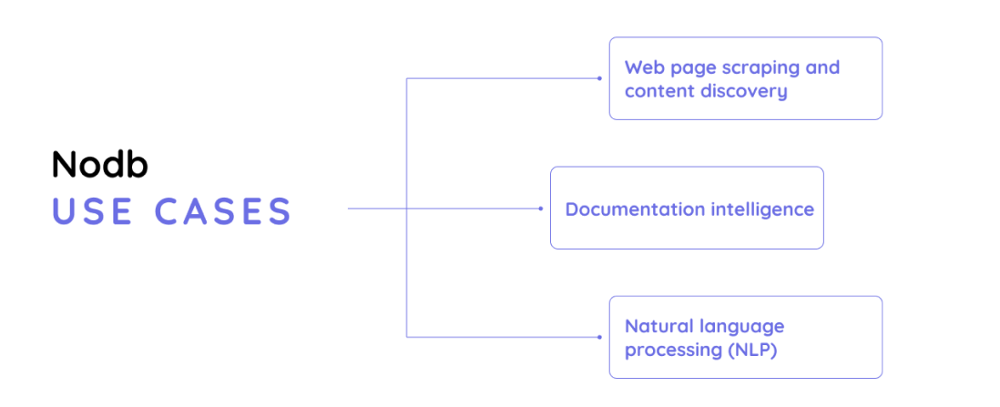

# API Gateway for Postgres for CRUD and vector search

## About the project

Artificial intelligence and machine learning models are transforming the way we interact with information. These models can access large datasets and effectively handle and use large volumes of data, creating new opportunities across industries.

Armed with first-hand insights into just how many doors were opened with AI and ML capabilities, the Nearup development team decided to contribute with our own solution. While our idea is still in the works, we wanted to give you a quick sneak peek into Nodb: an API gateway that leverages modern AI techniques to extract information using natural language and remove complexities of CRUD operations, pagination, and sorting.

The idea for the Nodb was born from our desire to provide our peers with a vector search solution that would cut the time they spend searching documents to understand how a particular function works. From an end-user point of view, Nodb vectorizes their questions and matches them to the nearest neighbor to provide immediate, detailed, and relevant feedback.

### Project Duration

The Nearup team began development in January 2024. Our next steps will involve enabling integration with some of the biggest messaging and collaboration tools, including WhatsApp, Telegram, and Slack. Additionally, we plan to enhance document querying capabilities through native AI parsing and enrichment prompts.

Our process and goals

We are developing unified access to multiple different databases, like MongoDB, Postgres, Redis, MySQL, and more. Nodb builds embedding models of everything it saves in its database, and this information can later be retrieved via natural language processing (NLP).

Our API simplifies database access and installation processes. Using a unified API gateway, there is no need to write separate code for each database or install them locally in the project. Instead, they can be accessed seamlessly through HTTP.

Note that the API we are creating deals with JSON data only, which means we can leverage OCR techniques to process documents like PDFs into JSON and store them in our database, just like any other database record.

### What can Nodb be used for?

So, what is our end goal? In simplest terms, it is to enable users to “Talk to the database.” Using vector search, we can conduct semantic searches and utilize Retrieval Augmented Generation (RAG), incorporating chat history as contextual information to engage in meaningful interactions with our data.

For instance, imagine a project manager looking to assign work based on their team's capabilities. The PM could ask, “Does Anna know how to work in React?” Relying on the information processed and kept in the database, they could receive feedback along the lines of, “No, she doesn't have React skills in her CV.”

But it's a lot more complex than that. The Nearup team built the API to facilitate several AI development use cases, primarily:

### Documentation intelligence

Nodb is built to handle different types of documents, including ID cards, receipts, PDF files, images, and more, which users submit for processing through optical character recognition (OCR) technology.

This will particularly be useful for HR professionals, who could rely on Nodb to request “first and last name, skills, and last two employers” for a job applicant. Ultimately, we see our product reducing the time it takes to review applicant profiles and browse large volumes of information before uncovering the ones that best match the criteria.

We are also confident in the successful application of Nodb in eCommerce, where traditional search methods struggle to capture the context and history that influence user preferences. Vector search capabilities of our solution will match user queries to their specific information, like preferences, interests, hobbies, and any other information that can be built into a detailed data representation. This will allow for personalized recommendations based on similarity to the user’s profile.

#### Web page scraping and content discovery

Our vector search implementation will help transform the content discovery experience. Unlike traditional search methods constrained by keywords, vector search represents product features as vectors in a multi-dimensional space. When users search for specific attributes, user queries are compared against the vectors representing all products in the dataset. Based on similarity, this comparison swiftly identifies the product and closely aligns it with the user’s preferences.

As such, Nodb will allow you to offer a more intuitive and personalized user experience, enhancing efficiency and satisfaction in finding relevant options. For example, users will be able to send a URL of a page they want to learn more about, ask any question about that page, and retrieve information such as Title Tag, meta description, or a complete list of products featured on the page (along with essential info like product name, price, and specifications).

#### Natural language processing (NLP)

When building Nodb, we also thought about the fact that vector search can aid in deepening the interaction with technologies like chatbots, virtual assistants, and language translators, making them more conversational and intuitive.

So, in a situation where a user needs a template for a memo, Nodb (empowered by vector search) will generate the memo itself, guided by the user’s constraints. How? By using NLP and nearest neighbor vectors from similar documents in AI LLMs, vector search helps AI understand and respond to queries with relevant information. This approach enhances the accuracy and efficiency of NLP applications and allows for a deeper understanding of user intent and context.

## Key Nodb features and solutions

At the time of writing, Nodb was still in the early stages of development. What we can share from our Project Specifications is the list of features we intend to roll out in phases:

1. Multiple environments within each application
2. Resource (entities) split between application collections
3. CRUD operations on single or multiple entities (GET, POST, PUT, PATCH, DELETE)
4. Vector search option using various embedding models (OpenAI, Voyage AI)
5. RAG feature using various LLMs (OpenAI, Claude)
6. Documents processing and storage (.pdf, .csv, .docx, etc.)
7. User-defined API options via environment variables
8. One-click deployment to Render
